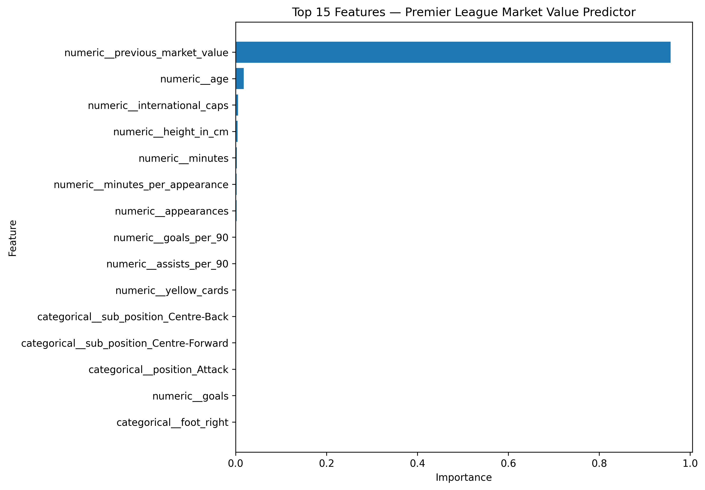

# ⚽ Premier League Player Market Value Predictor

A machine learning project that predicts a Premier League player's next **Transfermarkt market value** using their previous valuation, player profile, and recent Premier League performance.

The project includes a trained **Random Forest regression model** and an interactive **Streamlit web application** where users can select a real player or manually enter their own player statistics.

---

## 🌐 Live App

The application is deployed using Streamlit Community Cloud.

**Live App:**  
https://txqp4dxwtmrowdenjcaxka.streamlit.app/

---

## 📌 Project Overview

The aim of this project is to investigate whether machine learning can estimate how a Premier League player's Transfermarkt market value will change.

Rather than attempting to predict a player's value completely from scratch, the model answers the question:

> **Given a player's previous Transfermarkt valuation and recent Premier League performance, what is their likely next Transfermarkt valuation?**

Historical player valuations and performance data are used to train the model.

---

## ✨ Features

The Streamlit application allows users to:

- Select a real Premier League player from the dataset
- Automatically load their player profile
- Automatically load their recent Premier League statistics
- Enter a player manually
- Modify player statistics to experiment with different scenarios
- Predict the player's next market value
- Compare their previous and predicted market values
- View the estimated value change and percentage change
- View performance metrics such as goals per 90 and assists per 90

---

## 🤖 Machine Learning Model

The final model uses a **Random Forest Regressor** implemented using scikit-learn.

Categorical variables such as position and preferred foot are transformed using one-hot encoding.

The target market value is transformed using:

```python
np.log1p(market_value)
```

The model therefore predicts the logarithm of market value.

Predictions are converted back into euros using:

```python
np.expm1(prediction)
```

---

## 📊 Model Performance

The model was evaluated using a **time-based train/test split**.

Older valuations were used for training, while valuations from **2025 onwards** were used as the test set. This provides a more realistic evaluation than randomly mixing historical and future valuations.

### Final Model

| Metric | Result |
|---|---:|
| MAE | **€2.43 million** |
| RMSE | **€4.18 million** |
| R² | **0.962** |

The model was also compared against a simple baseline that assumes:

> **Next market value = Previous market value**

| Model | MAE | RMSE | R² |
|---|---:|---:|---:|
| Previous Value Baseline | €2.80m | €4.59m | 0.955 |
| Final Random Forest | **€2.43m** | **€4.18m** | **0.962** |

This shows that the machine learning model improves upon simply assuming a player's value will remain unchanged.

---

## 🧠 Model Features

The model uses the following player characteristics:

### Player Profile

- Age
- Position
- Specific position
- Preferred foot
- Height
- International caps

### Recent Performance

- Premier League appearances
- Goals
- Assists
- Minutes played
- Yellow cards
- Red cards

### Engineered Features

The project also calculates:

- Goals per 90 minutes
- Assists per 90 minutes
- Minutes per appearance

### Market Information

- Previous Transfermarkt market value

---

## 📈 Feature Importance

The model found that **previous market value is by far the strongest predictor** of a player's next valuation.

This is reasonable because football player valuations generally change progressively rather than being calculated completely from scratch after every valuation update.

Age, international experience, playing time and recent performance also contribute to the model's predictions.



---

## 💰 Performance by Player Value

The model's error was also analysed across different market-value ranges.

| Market Value | Players | MAE | RMSE | Mean % Error |
|---|---:|---:|---:|---:|
| Under €1m | 229 | €124k | €176k | 38.6% |
| €1m–€10m | 855 | €818k | €1.26m | 20.2% |
| €10m–€30m | 1,074 | €2.28m | €3.19m | 13.2% |
| €30m–€50m | 427 | €4.19m | €5.43m | 11.7% |
| Over €50m | 281 | €7.11m | €9.48m | 10.0% |

Absolute prediction errors increase for more valuable players, while the average percentage error generally decreases.

---

## 📂 Dataset

The project uses publicly available Transfermarkt datasets from the:

**dcaribou/transfermarkt-datasets**

dataset repository.

The original dataset contains information including:

- Players
- Historical market valuations
- Appearances
- Clubs
- Games
- Transfers
- Competitions

The raw data files are not included in this repository because some are too large for standard GitHub storage.

Instead, the deployed application uses a smaller preprocessed dataset:

```text
app_players.csv
```

This contains the player information and recent Premier League statistics required by the Streamlit application.

---

## 🕒 Historical Data

Historical Premier League valuations from **2015 onwards** are used to construct the machine learning dataset.

For each historical valuation, the player's Premier League performance during the **previous 365 days** is calculated.

This means each training example represents information that would have been available around the time of that valuation.

The previous market value is calculated using the player's **full career valuation history**, rather than only their Premier League history.

This is particularly important for players who move into or out of the Premier League.

---

## 🏗️ Project Structure

```text
premier-league-market-value-predictor/
│
├── app.py
│
├── app_players.csv
│
├── feature_importance.png
│
├── premier league market value.py
│
├── requirements.txt
│
├── .gitignore
│
└── models/
    └── market_value_model_compressed.pkl
```

### Main Files

**`app.py`**

Runs the interactive Streamlit application.

**`app_players.csv`**

Contains the preprocessed player information used by the deployed application.

**`premier league market value.py`**

Contains the data processing, feature engineering, model training and evaluation code.

**`market_value_model_compressed.pkl`**

The trained machine learning model used by the Streamlit application.

**`feature_importance.png`**

Visualisation showing which features contribute most strongly to the model.

---

## 🚀 Running the Project

### 1. Clone the repository

```bash
git clone https://github.com/josephoraw-create/premier-league-market-value-predictor.git
```

### 2. Enter the project directory

```bash
cd premier-league-market-value-predictor
```

### 3. Install dependencies

```bash
python -m pip install -r requirements.txt
```

### 4. Run the Streamlit application

```bash
python -m streamlit run app.py
```

Streamlit should then provide a local address, normally:

```text
http://localhost:8501
```

---

## 🛠️ Technologies Used

The project was built using:

- **Python**
- **pandas** — data manipulation
- **NumPy** — numerical operations
- **scikit-learn** — machine learning
- **Random Forest Regression** — prediction model
- **Streamlit** — interactive web application
- **Matplotlib** — data visualisation
- **Joblib** — model storage
- **Git & GitHub** — version control and hosting

---

## ⚠️ Limitations

The model predicts **Transfermarkt market valuations**, not actual football transfer fees.

Real-world player valuations can be affected by factors that are not currently included in the model, including:

- Injuries
- Contract length
- Transfer rumours
- Club financial situations
- Player reputation
- International tournaments
- Tactical changes
- Sudden breakout performances

Previous market value is also the strongest feature in the model. Therefore, the model performs particularly well when valuations change gradually but can struggle to predict sudden large increases or decreases.

Recent performance features currently focus on **Premier League appearances**. This means a player who has recently arrived from another league may have limited recent performance information available to the model.

---

## 🔮 Future Improvements

Future versions of the project could include:

- Performance data from leagues outside the Premier League
- Contract length
- Injury history
- Club strength
- League strength
- Expected goals (xG)
- Expected assists (xA)
- Player historical value graphs
- Player comparison functionality
- Permutation feature importance
- Alternative models such as Gradient Boosting or XGBoost

---

## 🎯 What I Learned

This project helped develop practical experience with:

- Cleaning and processing large real-world datasets
- Combining multiple football datasets
- Preventing data leakage
- Feature engineering
- Time-based machine learning evaluation
- Regression model evaluation
- Comparing models against a baseline
- Building scikit-learn pipelines
- Deploying machine learning models
- Building interactive applications with Streamlit
- Managing large files for GitHub deployment
- Git and GitHub version control

---

## 📜 Disclaimer

This project is intended for **educational and portfolio purposes**.

Transfermarkt market values are estimates and should not be interpreted as official transfer prices.

---

## 👤 Author

**Joseph O'Raw**

University of Nottingham student with interests in **software engineering, machine learning and artificial intelligence**.
